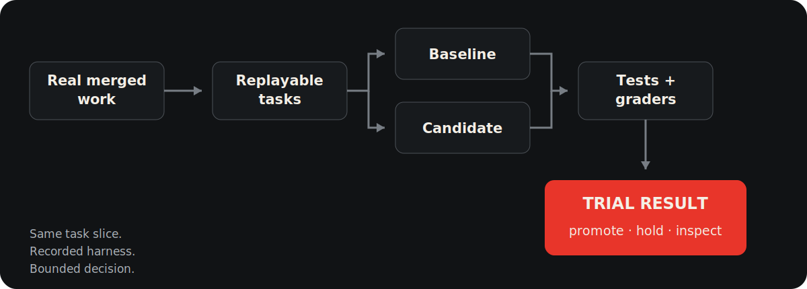

<p align="center">
  
</p>

<p align="center"><strong>Change control for AI coding agents</strong></p>

# Improve the instructions, skills, and model settings your coding agents actually use

Accepted repository work becomes replayable tasks so Stet can measure whether
an `AGENTS.md` change, shared skill, model, or reasoning setting improves agent
behavior before rollout. The coding agent proposes and applies changes; Stet
measures the result against matched repository work and gates scoped promotion.

[Get started](BETA_QUICKSTART.md) · [See an example result](#example-trial-result) ·
[Understand how Stet works](ONBOARDING.md)

## What do you want to improve?

### A/B test an `AGENTS.md` change

Compare current and proposed instructions on the same retained repository
tasks, with the model fixed across both arms. Stet returns a scoped `promote`,
`hold`, or `inspect` recommendation for the selected corpus and recorded
harness.

> Use the Stet skill to A/B test my proposed `AGENTS.md` change. Keep the model
> fixed, plan before launch, and return the canonical Trial Result with its
> recommendation, evidence limitations, and next action.

### Improve `AGENTS.md` iteratively — Advanced

Let your coding agent change one allowed instruction lever at a time while Stet
persists loop state, measures each candidate, and protects holdout and promotion
boundaries. The coding agent edits; Stet records, compares, selects, and gates.

> Use the Stet skill to improve `AGENTS.md` within a bounded search space and
> stop rule. Test one change at a time and ask before using holdout evidence or
> promoting a finalist.

### Test whether a skill helps

Compare behavior with and without a new skill, or compare a committed skill
with a revision, using replayable tasks and behavior-relevant graders. A new
skill needs a true skill-absent baseline; a revision uses the committed skill.

> Use the Stet skill to test whether this repo-managed skill helps. Plan before
> launch, use the right baseline, and report `promote`, `hold`, or `inspect`.

### Choose a model or reasoning effort

Compare models on the same retained tasks, or hold the model fixed and compare
reasoning-effort arms. Read correctness, quality, cost, uncertainty, validity,
and residual risk separately; unavailable or incomparable dimensions stay
visible.

> Use the Stet skill to compare these configurations on the same repository
> tasks. First ask whether I want a cheap diagnostic read or a gateable rollout
> decision. Keep diagnostic evidence labeled directional; for a gateable choice,
> use matched runs and return the canonical Trial Result.

## How Stet works



Stet packages selected history as replayable tasks. It declares the treatment
being tested and its intent, runs a baseline and candidate against the same task
slice while controlling the other harness settings that are relevant, evaluates
both with tests and declared graders, and writes a canonical Trial Result with
one scoped recommendation and next action.

## Example Trial Result

### A real decision from repository work

Historical April 2026 model comparison across 28 paired Zod tasks, with Opus
4.6 and Opus 4.7 at identical high reasoning.

| Observed measure | Opus 4.6 | Opus 4.7 |
| --- | ---: | ---: |
| Test pass rate | 42.9% | 42.9% |
| Equivalence rate | 32.1% | 46.4% |
| Observed cost per task | $19.96 | $8.11 |
| Mean agent duration | 7m 58s | 3m 12s |

**Historical receipt: `PROMOTE` candidate Opus 4.7, high confidence.**

On this task corpus, the historical receipt recommended Opus 4.7 after it held
the observed test pass rate steady, improved observed equivalence, and used less
observed cost and time. These are selected observations; the receipt also used
declared grader evidence not reproduced here.

Historical April 2026 result, scoped to this 28-task Zod corpus and recorded
harness. The legacy report predates Stet's current calibration and
claim-readiness fields, so the displayed metric values are observations, not
generalized or uncertainty-calibrated improvement claims.

## Install and get a first result

The CLI ships for macOS and Linux on x86_64 and arm64, and for Windows on amd64.
The documented end-to-end Docker-backed evaluation workflow is currently for
macOS and Linux.

macOS and Linux:

```sh
curl -fsSL https://raw.githubusercontent.com/Stet-AI/stet-cli/main/install.sh | sh
```

Windows PowerShell:

```powershell
irm https://raw.githubusercontent.com/Stet-AI/stet-cli/main/install.ps1 | iex
```

Sign in to commercial Stet workflows, then install the Stet agent skill:

```sh
stet auth login
stet auth status
npx skills add https://github.com/Stet-AI/stet-cli.git --skill stet --all
stet --version
npx skills list
```

The default evaluation path also needs a running Docker daemon, Python 3.12+,
`uv`, and authentication for the model provider you plan to evaluate. The
[beta quickstart](BETA_QUICKSTART.md) covers platform setup and verification.

In the repository you want to evaluate, ask your coding agent:

> Use the Stet skill to onboard this repo. First ask what work and decision I
> want Stet to track. Read CI and repository history, propose a starter slice
> from real merged work, prove which retained tasks are build-ready, and report
> the slice rationale, coverage, gaps, and confidence. Stop with an onboarding
> receipt before model evaluations; do not claim the slice is automatically
> representative.

## Why trust the result?

Stet keeps correctness, quality, cost, uncertainty, validity, and grader
coverage separate. Recommendations apply only to the declared change, selected
task corpus, and recorded harness. Missing, stale, partial, invalid, or
under-graded evidence cannot support promotion; Stet preserves the actual
blocker status and exact next action instead of presenting it as rollout proof.

Evaluation artifacts normally remain in local Stet output roots, and the
audited Stet control-plane client path does not upload repository contents or
evaluation artifacts. Configured coding-agent and grader providers can receive
task instructions, repository context, patches, tests, and grading context.
When you are signed in, the CLI also sends best-effort command-category and
status events associated with the authenticated user. Those events are
persisted server-side. Event metadata may include the root command, selected
model or models, mode, output-directory basename, generic failure
classification, and entitlement status or reason. A first-evaluation success
or failure can enqueue customer outreach. The CLI currently exposes no
telemetry opt-out. Stet does not claim a universal network sandbox.

## Learn more

- [Beta quickstart](BETA_QUICKSTART.md)
- [Prompt cookbook](PROMPT_COOKBOOK.md)
- [How Stet works](ONBOARDING.md)
- [Troubleshooting](TROUBLESHOOTING.md)

The install script and agent skill are available under the [MIT License](LICENSE).
The distributed Stet binary is governed by the [Stet Binary Terms](TERMS.md).
